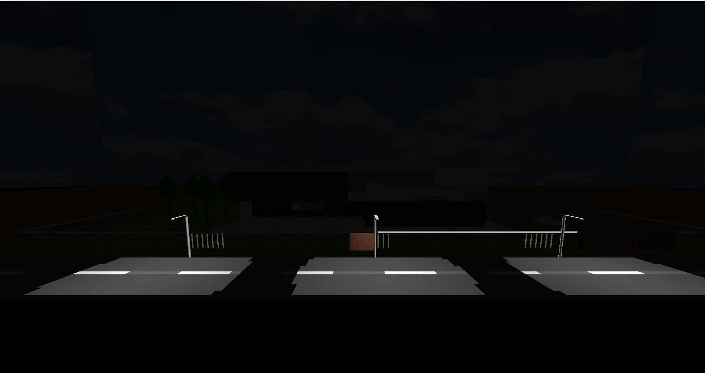
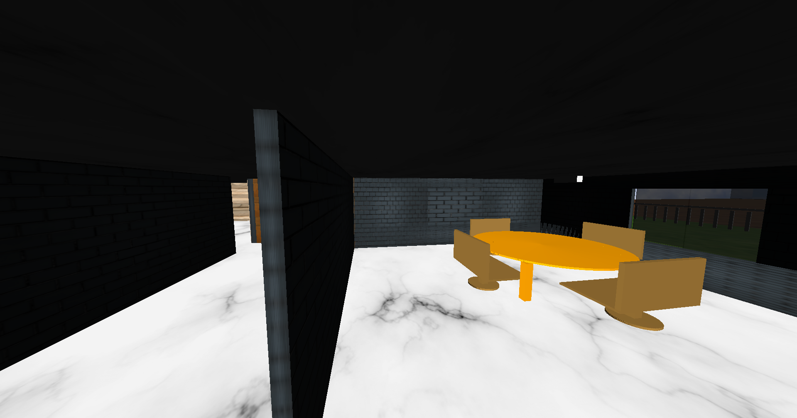

<h1>3D-Complete-House-in-OpenGL</h1>

A computer graphics based project built using C++ and OpenGL.


<h2>Features: </h2>
<ul>
    <li>Collision detection mechanism. That prevent viewer from travelling through the walls. Provide real life travelling system in the project.</li>
    <li>Switching to different views using hot-keys.</li>
    <li>Roll, Pitch, Yaw, Birds eye view functionalities that enables viewer to dynamically travel in the environment.</li>
    <li>Contains all 8 lights with different functionalities.</li>
    <li>Texturing of objects.</li>
    <li>Fully functional Stand fan.</li>
    <li>Fully functional windows.</li>
    <li>Different types of doors.</li>
    <li>Transparent objects.</li>
</ul>

<h2>Key-Movements: </h2>
A different approach is taken here to map all the features of the project using key-bindings.
Key movements has 5 different modes.
<ul>
    <li>"!" -> enables light controlling mode.</li>
    <li>"@" -> enables viewing controling mode.</li>
    <li>"#" -> enables Fan controling mode.</li>
    <li>"$" -> enables Doors controlling mode.</li>
    <li>"%" -> enables Windows controlling mode.</li>

</ul>

<h3>Light controlling mode "!":</h3>
<table style="border: 1px solid black;">
    <tr>
        <th>Key</th>
        <th>Functions</th>
    </tr>
    <tr>
        <td>1</td>
        <td>toggling on/off the environment light</td>
    </tr>
    <tr>
        <td>2,3,8</td>
        <td>toggling on/off street lights.</td>
    </tr>
    <tr>
        <td>4,5,6,7</td>
        <td>toggling on/off lights in rooms.</td>
    </tr>
    <tr>
        <td>9</td>
        <td>toggiling position of lights in rooms. Enabling switch room's lights to upper floor.</td>
    </tr>
</table>

<h3>Viewing controlling mode "@":</h3>
<table style="border: 1px solid black;">
    <tr>
        <th>Key</th>
        <th>Functions</th>
    </tr>
    <tr>
        <td>w,a,s,d</td>
        <td>change view up,left,down,right respectively.</td>
    </tr>
    <tr>
        <td>PageUp, PageDown</td>
        <td>change viewer positon up and down.</td>
    </tr>
    <tr>
        <td>arrow keys(up,left,down,right)</td>
        <td>changes viewer postion up, left, down, right respectively.</td>
    </tr>
    <tr>
        <td>1,2,3,4,5</td>
        <td>Moves viewer position in different rooms of ground floor.</td>
    </tr>
    <tr>
        <td>6,7,8,9,0</td>
        <td>Moves viewer position in different rooms of up floor.</td>
    </tr>
</table>

<h3>Fan controlling mode "#":</h3>
<table style="border: 1px solid black;">
    <tr>
        <th>Key</th>
        <th>Functions</th>
    </tr>
    <tr>
        <td>f</td>
        <td>toggle on/off fan.</td>
    </tr>
    <tr>
        <td>g</td>
        <td>toggle horizontal movements of fan.</td>
    </tr>
    <tr>
        <td>1,2,3</td>
        <td>3 different speed state of fan. 3 > 2 > 1</td>
    </tr>
</table>

<h3>Door controlling mode "$":</h3>
<table style="border: 1px solid black;">
    <tr>
        <th>Key</th>
        <th>Functions</th>
    </tr>
    <tr>
        <td>b</td>
        <td>toggling open/close main door of the house.</td>
    </tr>
    <tr>
        <td>n</td>
        <td>toggling open/close of outside door.</td>
    </tr>
    <tr>
        <td>m</td>
        <td>toggling open/close sliding door of the garadge.</td>
    </tr>
    <tr>
        <td>h, j, k, l, ;</td>
        <td>toggling open/close room doors.</td>
    </tr>
</table>

<h3>Windows controlling mode "%":</h3>
<table style="border: 1px solid black;">
    <tr>
        <th>Key</th>
        <th>Functions</th>
    </tr>
    <tr>
        <td>q, w, e, r, o</td>
        <td>close the windows of the left side of the house.</td>
    </tr>
    <tr>
        <td>Q, W, E, R, O</td>
        <td>open the windows of the left side of the house.</td>
    </tr>
    <tr>
        <td>t, y, u, i</td>
        <td>close the windows of the right side of the house.</td>
    </tr>
    <tr>
        <td>T, Y, U, I</td>
        <td>open the windows of the right side of the house.</td>
    </tr> 
    <tr>
        <td>a</td>
        <td>open the window of the front side of the building.</td>
    </tr>
    <tr>
        <td>A</td>
        <td>close the window of the front side of the building.</td>
    </tr>

</table>

<h2>Code Compilation: </h2>

```bash
    g++ main.cpp -o house -lglut -lGLU -lGL # for compiling
    ./house                                 # for running the code
```

<h2>Project Screenshots: </h2>
<h3>Outside views: </h3>
<h4>Front</h4>
 
<br>
<h4>top</h4>

<br>
<h4>left</h4> 

<br>
<h4>right</h4> 
 
<br><br>

<h3>Light views: </h3>
<h4>Environment light off</h4>
 
<h4>Street lights on</h4>
 


<br><br>
<h3>Door views: </h3>
<h4>Outside doors opened</h4>
 
<h4>Inside doors close</h4>
 
<h4>Inside doors opened</h4>
 


<br><br>
<h3> Inside room views: </h3>
<h4>Drawing room</h4>
 
<h4>Bedroom</h4>
 
<h4>Dinning room</h4>
 
<h4>Washroom</h4>
 
<h4>Stairs</h4>
 
<h4>Study room</h4>
 

